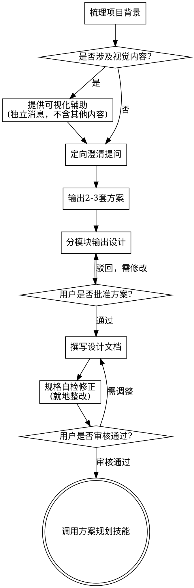

name: 头脑风暴
description: "开展所有创意工作前必须使用本技能——包含功能创建、组件搭建、能力新增或逻辑改造。在落地实施前，先梳理用户意图、明确需求并完成方案设计。"
---
# 头脑风暴：从想法到方案设计

借助自然协作式对话，协助你将零散想法完善为完整设计方案与规格说明。

先了解当前项目背景，再**逐次单次提问**细化需求。充分明确建设内容后，输出完整方案并等待用户确认。

<HARD-GATE>
在完整设计方案输出并获得用户批准前，**严禁调用任何开发落地技能、编写代码、初始化项目、执行任何开发操作**。无论需求看起来多简单，该规则对所有项目强制生效。
</HARD-GATE>

## 反模式误区：「需求太简单，不需要设计」

所有项目必须走完本流程。待办清单、单功能工具、配置修改，无一例外。
越是看似简单的需求，越容易因未经审视的主观假设造成大量无效返工。
简易项目可精简设计内容（极简需求仅需几句话），但**方案输出+用户确认**环节不可省略。

## 执行清单

必须按顺序逐条创建任务并闭环完成：

1.  **梳理项目背景** — 查阅项目文件、文档、近期提交记录
2.  **提供可视化辅助**（涉及视觉类内容时）——单独消息发送，禁止与问题合并。详见下方「可视化辅助」说明。
3.  **定向澄清提问** — 每次只提一个问题，明确目标、约束条件、验收标准
4.  **输出2-3套方案** — 附带优劣取舍说明，并给出推荐方案
5.  **分模块输出设计** — 根据业务复杂度拆分章节，每节完成后同步等待用户确认
6.  **撰写设计文档** — 保存至 `docs/superpowers/specs/年月日-主题-设计.md` 并提交归档
7.  **规格自检复核** — 快速自查占位符、逻辑冲突、表述歧义、需求范围（详见下文）
8.  **用户审核方案文档** — 推进开发前，请用户审阅已撰写完成的规格文件
9.  **转入实施规划** — 调用方案规划技能，输出落地执行计划

## 流程图示

**流程终点：仅允许调用方案规划技能。**
禁止调用前端设计、组件构建或其他任何落地实施类技能。头脑风暴结束后，唯一可调用的后续技能为：方案规划。
完整流程规范
需求理解阶段
优先核查项目现状：现有文件、资料文档、近期代码提交记录
需求范围预判：若需求包含多个独立子系统（例如「搭建含聊天、文件存储、付费、数据分析的平台」），需立刻标注拆分，禁止在未拆解前纠结细节
超大需求拆分：单份方案无法承载的复杂项目，协助用户拆分为独立子项目、梳理依赖关系与开发顺序，按单个子项目走完整设计流程。每个子项目独立执行「方案文档→规划→落地」闭环
常规需求：逐次单次提问，层层细化需求
提问形式：优先选择题，也可使用开放式问题
消息规则：每条消息只提一个问题；如需深度调研，拆分为多条消息依次提问
聚焦核心：重点理清业务目标、约束限制、成功验收标准
方案调研阶段
输出 2~3 种差异化实现路径，附带利弊权衡说明
以自然对话形式展示选项，明确给出推荐方案及选择理由
优先展示推荐方案，并说明决策依据
方案输出阶段
充分确认需求边界后，正式输出完整设计方案
内容适配复杂度：简单需求精简表述，复杂业务补充细节说明
分段确认原则：每完成一个设计章节，同步确认内容是否符合预期
必含设计维度：架构设计、模块组成、数据流转、异常处理、测试策略
动态迭代：存在信息偏差或疑问时，及时回溯澄清、调整方案
高内聚低耦合设计原则
系统拆分：拆解为职责单一的最小独立单元，通过标准化接口交互，支持独立阅读、独立测试
单元设计三要素：明确模块能力、使用方式、依赖关系
边界解耦：外部使用者无需了解内部逻辑；迭代内部代码不影响上游业务。边界不合理时需优化调整
轻量化设计：边界清晰、职责单一的模块更易维护；文件内容臃肿，通常代表职责过载
存量项目适配规范
改造现有项目时，先熟悉现有架构与规范，遵循项目固有设计模式
存量问题优化：若现有架构存在明显缺陷（文件臃肿、边界模糊、职责混乱），可在本次设计中同步做针对性优化
克制优化范围：不做无关重构，所有调整仅服务于当前业务目标
方案定稿后置流程
文档规范
将审核通过的最终方案，归档至：docs/superpowers/specs/年月日-主题-设计.md
若用户指定自定义路径，优先遵循用户规则
行文遵循简洁清晰的写作规范
设计文档完成后提交代码仓库归档
方案自检细则
文档撰写完成后，重新审视自查：
占位内容排查：清理待定项、待办备注、残缺内容、模糊描述
内容一致性：各章节无逻辑冲突，架构描述与功能说明保持统一
范围边界核查：确认范围收敛，适配单次落地规划，超复杂内容需二次拆解
歧义消除：杜绝多义性表述，存在多种解读时统一口径、明确写明
问题就地修改修复，无需重复全量复核，整改完成即可推进。
用户审核卡点
自检完成后，必须邀请用户审阅文档，固定话术：
"方案文档已编写完成并提交至「文件路径」。请审阅确认，若无异议，我们将开始制定落地实施计划；如需修改，可随时告知。"
等待用户反馈；收到修改意见则迭代修正并重新自检，用户明确批准后方可进入下一阶段。
落地衔接
调用方案规划技能，输出详细实施计划
禁止调用任何其他实施类技能，下一步固定为：方案规划
核心原则
单次单问：避免一次性堆砌大量问题造成负担
优先选择题：降低决策成本，提升沟通效率
按需精简设计：坚决剔除冗余功能，拒绝过度设计
多方案备选：最终定案前，必须提供至少 2~3 套备选思路
分段式确认：模块化输出、分步审批，小步迭代降低风险
灵活调整：信息缺失或理解偏差时，及时回溯澄清、动态调整
可视化辅助说明
头脑风暴过程中，可通过网页端展示原型、架构图、布局对比等视觉内容，仅作为辅助工具，非强制启用。
启用规则
预判后续讨论涉及原型、排版、架构图等视觉内容时，必须单独发送一条纯文本消息发起申请，禁止与提问、总结等内容合并：
"本次设计部分内容通过网页图示会更易理解，我可以同步提供产品原型、架构示意图、方案对比等可视化内容。该功能为新能力，会消耗较多资源，是否开启试用？（需打开本地链接查看）"
邀约消息只能包含以上内容，无额外文字；等待用户回复后再继续沟通
若用户拒绝，全程使用纯文字沟通设计
场景区分
即便用户同意开启，也需按需判断每轮沟通的展示形式：
判定标准：看图理解 是否 优于 纯文字阅读
适用可视化：产品原型、线框图、布局对比、架构图谱、视觉方案比对
适用纯文字：需求澄清、概念探讨、方案取舍、范围界定、文字类选项
用户同意开启后，如需使用可视化能力，查阅指引文档：
skills/brainstorming/visual-companion.md